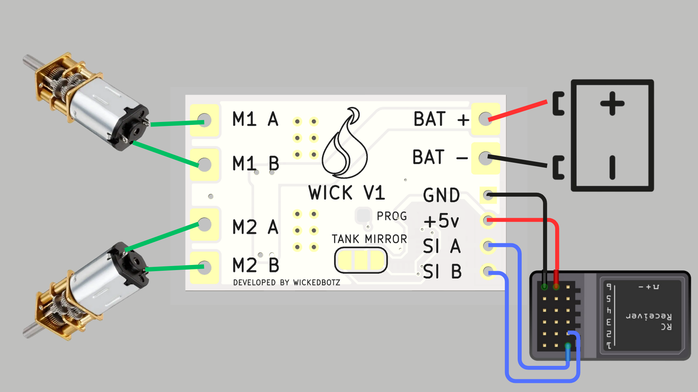

# WICK V1 - ESC Duplo para Motores DC

**WICK V1** é um controlador compacto para dois motores DC, ideal para robôs com cinemática diferencial, veículos RC, robôs de combate e outras aplicações embarcadas. Desenvolvido pela **Kinematech**, o WICK V1 permite controle preciso via rádio transmissor PPM, com suporte a três modos distintos de operação.

Este repositório contém o firmware do WICK V1, desenvolvido para microcontroladores AVR da família ATtiny, como o **ATtiny1616**, utilizando sinais PPM para controle e PWM para acionamento dos motores.

---

## 📁 Arquivos do Repositório

- `ppm_to_control_motors_v5.ino` – Código principal que interpreta o sinal PPM e controla os motores via PWM.
- `motor.h` – Biblioteca para abstração do controle de motores.
- `turnigy.h` – Definições dos limites do sinal PPM compatível com rádios Turnigy/Flysky.

---

## 🔌 Modos de Operação

O firmware detecta o modo com base no valor do **canal 3 do sinal PPM**:

1. **Tank Mode**  
   - Canal 1 → Motor A  
   - Canal 2 → Motor B  
   Ideal para robôs com controle independente por tração (ex: robôs de combate com manobras agressivas).

2. **Mirror Mode**  
   - Canal 1 controla ambos os motores na mesma direção.  
   Útil para sistemas onde os motores devem girar juntos, como esteiras.

3. **Mix Mode**  
   - Canal 1 → Avanço / Recuo  
   - Canal 2 → Direção (curvas)  
   Semelhante ao controle usado em rádios tipo pistola, combinando movimento e direção.

---

## ⚙️ Requisitos

- Uma **placa WICK V1** com microcontrolador **ATtiny1616** embarcado.
- Fonte de alimentação para motores e lógica (recomendado: 2S ou 3S com regulador de 5V).
- Rádio transmissor compatível com sinal PPM (Turnigy, FlySky, etc.).
- **Conversor USB-Serial** para gravação do firmware:
  - Pode ser um programador UPDI dedicado (ex: MPLAB SNAP, Atmel ICE)  
  - Ou um **adaptador USB-Serial comum** modificado:

### 🔧 Como adaptar um USB-Serial comum para UPDI

É possível programar o ATtiny1616 utilizando um conversor USB-Serial comum com apenas **1 resistor** e **1 diodo**:

#### Esquema de ligação

```
Conversor USB-Serial        ATtiny1616 (WICK V1)
---------------------       ---------------------
TX ------------------/\/\/\--+                 |
                  4.7kΩ      |                 |
                             |                UPDI
                             |                 |
RX ----|<|-----+-------------+                 |
       1N4148  |                               |
              |                               GND
             GND

Alimente o circuito com 5V durante a gravação.
```

> Use software como [pyupdi](https://github.com/mraardvark/pyupdi) ou a Arduino IDE com suporte ao core `megaTinyCore`.

---

## 🚀 Como Usar

1. Grave o firmware no ATtiny1616 com o adaptador UPDI.
2. Conecte o sinal PPM vindo do receptor de rádio nos pinos `SI A` e `SI B`.
3. Conecte os motores nas saídas `M1 A/B` e `M2 A/B`.
4. Alimente a placa com a tensão adequada nos terminais `BAT +` e `BAT -`.

### 🖼️ Esquema de ligação



---

## 🛡️ Segurança e Proteções

- Watchdog de sinal PPM: se o sinal for perdido por mais de um tempo limite, os motores são desligados.
- Curva de aceleração suave para evitar picos.
- Modulação PWM ajustada para eficiência e controle térmico.

---

## 🛠️ Futuras Melhorias

- Telemetria por UART (corrente, tensão, modo ativo).
- Configuração dos canais via botão ou interface serial.
- Calibração automática de PWM de rádio.

---

## 📜 Licença

Este projeto está licenciado sob a [MIT License](LICENSE).

---

Desenvolvido com 💡 por [Kinematech](https://github.com/kinematech)  
Foco em robótica acessível, controle inteligente e inovação em sistemas embarcados.
